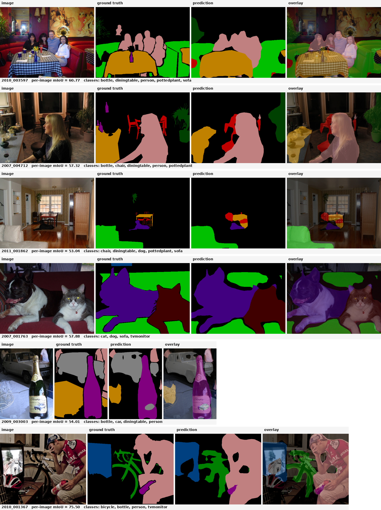

# 🎯 DINOv3 + PSPNet：语义分割的强大组合

> 基于 DINOv3 ViT-S/16 骨干网络 + PSPNet 金字塔池化模块的高效语义分割方案

## 📊 核心成果

仓库系统实现并端到端复现了三种结构变体,均跑在单卡 RTX 5060 Ti 上:

1. **Baseline 🥉** —— 骨干完全冻结,仅 PPM 解码器(2.81 M 可训练)
2. **Strategy B 🥈** —— 骨干完全冻结 + 多尺度特征对齐(MSFA),融合 ViT 第 {3, 6, 9, 11} 层特征(4.29 M 可训练)
3. **Strategy A 🥇** —— 解冻最后 2 个 transformer block,以 1/100 base LR 微调,从 baseline 检查点 warm-start(6.37 M 可训练)

最强配置 (**Strategy A,MS+flip**) 在 Pascal VOC 2012 验证集上达到 **86.68 mIoU** ✨ — 超越原 PSPNet (ResNet-101 + ImageNet+COCO,85.4),所用骨干网络小 ~7 倍,且大部分仍冻结。

实现遵循 [DINOv3_PSPNet_Project_Plan.md](DINOv3_PSPNet_Project_Plan.md)。

### 📈 性能总览

| 方法 | 骨干网络 | 可训练 | mIoU(单尺度) | mIoU(MS+flip) |
|---|---|---:|---:|---:|
| PSPNet (Zhao et al. 2017) | ResNet-101 (ImageNet) | full ~50 M | — | 82.6 |
| PSPNet (Zhao et al. 2017) | ResNet-101 (ImageNet + COCO) | full ~50 M | — | 85.4 |
| **Baseline 🔹** | DINOv3 ViT-S/16 *(完全冻结)* | 2.81 M | 85.53 | **86.17** |
| **Strategy B 🔹** | DINOv3 ViT-S/16 *(完全冻结)* + MSFA | 4.29 M | 85.61 | **86.44** |
| **Strategy A 🔹** | DINOv3 ViT-S/16 *(末 2 层解冻)* | 6.37 M | 86.06 | **86.68** |

💡 **训练耗时**:Baseline 与 Strategy B 各跑 60 epoch ~30 分钟;Strategy A 因为 warm-start,**只跑 ~3 epoch 就收敛**。

### 🎨 定性结果展示



六张验证集图像的并排定性对比(基线检查点)

### 🏆 三策略每类 IoU 对比(MS+flip)

| 类别 | Baseline | Strat. B | Strat. A | Δ A vs Base |
|---|---:|---:|---:|---:|
| 背景 (background) | 96.50 | 96.74 | 96.70 | +0.20 |
| 飞机 (aeroplane) | 94.54 | 95.32 | 94.62 | +0.08 |
| 自行车 (bicycle) | 72.08 | **76.97** | 75.03 | +2.95 |
| 鸟 (bird) | 93.61 | 94.36 | **94.48** | +0.87 |
| 船 (boat) | 82.00 | **84.04** | 82.13 | +0.13 |
| 瓶 (bottle) | 86.29 | 84.56 | **87.03** | +0.75 |
| 巴士 (bus) | 95.84 | **97.26** | 96.00 | +0.16 |
| 汽车 (car) | 92.22 | 92.72 | 92.68 | +0.47 |
| 猫 (cat) | 95.48 | 96.21 | **96.38** | +0.91 |
| 椅子 (chair) | **49.31** | 49.13 | 48.80 | −0.51 |
| 牛 (cow) | 93.52 | 92.14 | **93.58** | +0.06 |
| 餐桌 (diningtable) | 74.21 | 72.94 | **74.85** | +0.64 |
| 狗 (dog) | 94.22 | **94.58** | 94.23 | +0.01 |
| 马 (horse) | 92.50 | 91.31 | **92.70** | +0.20 |
| 摩托车 (motorbike) | 92.67 | 92.52 | **93.78** | +1.11 |
| 人 (person) | 93.16 | **93.99** | 93.62 | +0.47 |
| 盆栽 (pottedplant) | 73.94 | 74.78 | **75.58** | +1.64 |
| 羊 (sheep) | 91.66 | **93.48** | 92.53 | +0.87 |
| 沙发 (sofa) | **69.58** | 66.02 | 67.99 | −1.59 |
| 火车 (train) | 93.48 | **94.21** | 94.01 | +0.54 |
| 电视 (tvmonitor) | 82.78 | 81.89 | **83.59** | +0.81 |
| **mIoU** | 86.17 | 86.44 | **86.68** | +0.51 |
| pAcc | 96.89 | 97.00 | 97.01 | +0.12 |
| mAcc | 92.23 | 92.39 | 92.55 | +0.31 |

💡 两种策略都对 **小尺寸 / 细线条 / 多尺度** 类别(自行车、摩托车、盆栽)帮助最大;两者都对 **大平面家具**(椅子、沙发)有轻微负面影响 — 与原版 PSPNet 论文报告的失败模式一致。

---

## 🏗️ 网络架构


### Baseline / Strategy A

```
            input image (B, 3, H, W),  H,W multiples of 16
                            │
              ┌─────────────▼────────────────────┐
              │  DINOv3 ViT-S/16                 │  21 M params
              │  Strategy A: blocks 10-11 解冻   │  (默认完全冻结;
              │  其余始终冻结                    │   Strategy A 解冻
              │  patch tokens, embed=384         │   末 2 块 + final norm)
              └──────┬──────────────────┬────────┘
            block 6 │                   │ final
       (B,384,h,w) │                   ▼ (B,384,h,w),  h=H/16, w=W/16
                    │            ┌──────────────┐
                    │            │  PPM         │  pyramid pool 1×1, 2×2, 3×3, 6×6
                    │            │  + 1×1 conv  │  reduce each branch to 96 ch
                    │            │  + upsample  │  concat with input → (B,768,h,w)
                    │            └──────┬───────┘
                    │                   ▼
                    │            ┌──────────────┐
                    │            │ Conv 3×3 256 │
                    │            │ BN, ReLU     │       2.81 M trainable
                    │            │ Dropout 0.1  │
                    │            │ Conv 1×1 21  │
                    │            └──────┬───────┘
                    │                   │ logits (B,21,h,w)
                    │                   ▼
                    │         bilinear ↑16  →  (B,21,H,W) ── main loss (CE, ignore=255)
                    ▼
              ┌──────────────┐
              │ Aux head     │  Conv3×3 → BN → ReLU → Drop → Conv1×1
              │ (train-only) │  upsample to (B,21,H,W)  ── aux loss × 0.4
              └──────────────┘
```

### Strategy B —— Multi-Scale Feature Alignment (MSFA)

```
              ┌──────────────────────────────────┐
              │  DINOv3 ViT-S/16  (frozen)       │
              └──┬────────┬────────┬────────┬────┘
               block 3  block 6  block 9  block 11
                 │        │        │        │
              ┌──▼──┐  ┌──▼──┐  ┌──▼──┐  ┌──▼──┐    each: 1×1 conv 384 → 96
              │ 1×1 │  │ 1×1 │  │ 1×1 │  │ 1×1 │           BN, ReLU
              └──┬──┘  └──┬──┘  └──┬──┘  └──┬──┘
                 └────────┴────────┴────────┘
                              │ concat → (B, 384, h, w)
                              ▼
                  ┌─────────────────────┐
                  │ 3×3 conv → BN → ReLU│   the "fuse" step
                  └──────────┬──────────┘
                             ▼
                          PPM + head  (same as baseline)
```

🔧 MSFA 模块([models/adapter.py](models/adapter.py))让 ViT 早/中/末层都能贡献给解码器;辅助监督仍然落在第 6 层的融合前特征上。

🔒 **冻结骨干网络**意味着骨干网络始终处于 `eval()` 模式,从不接收梯度;仅 PPM、分割头、辅助头(及 Strategy A 中末 2 个 ViT block)进行参数更新。

---

## 📁 项目结构

```
configs/
  ├─ voc_config.yaml                  # 📋 Baseline(完全冻结骨干)
  ├─ voc_config_msfa.yaml             # 🔁 Strategy B(冻结 + MSFA)
  └─ voc_config_strategy_a.yaml       # 🔓 Strategy A(末 2 层解冻 + warm-start)

models/
  ├─ backbone.py                      # 🦴 DINOv3 包装器(绕过 torch.hub.load,支持部分冻结)
  ├─ adapter.py                       # 🔗 FeatureAlignmentAdapter(Strategy B)
  ├─ ppm.py                           # 🔺 Pyramid Pooling Module
  ├─ aux_head.py                      # 📍 辅助分割头
  └─ segmentor.py                     # 🎯 完整 DINOv3PSPNet(基线 / B 自动切换)

datasets/
  ├─ voc_dataset.py                   # 📊 VOC2012 + 可选 SBD trainaug
  └─ transforms.py                    # 🔄 联合图像+掩码变换

utils/
  ├─ losses.py                        # 💥 CE + 辅助 CE
  ├─ metrics.py                       # 📈 流式混淆矩阵 mIoU
  ├─ scheduler.py                     # ⏱️  Poly LR + 预热,支持 per-param-group base_lr
  └─ visualize.py                     # 🎨 VOC 调色板着色 / overlay

scripts/
  └─ smoke_test.py                    # ✅ CPU/GPU 前向检查,无需真权重

入口脚本
  ├─ train.py                         # 🚂 训练(支持 param 分组、init_from warm-start)
  ├─ eval.py                          # 📊 评估(单尺度 / MS+flip TTA)
  └─ infer.py                         # 🎬 目录或单图推理

存储目录
  ├─ docs/                            # 🖼️  架构图(1.png 总览,2.png MSFA 细节)
  ├─ weights/                         # 📦 dinov3_vits16_*.pth
  ├─ data/                            # 💾 VOCdevkit/(可选 VOCaug/)
  └─ runs/                            # 📤 输出(日志、ckpt、tb、eval json、infer png)
```

---

## 🚀 快速开始

### 1️⃣ Python 环境配置

```bash
conda create -n dinov3seg python=3.10 -y
conda activate dinov3seg
pip install -r requirements.txt
```

✅ **要求**:需要 PyTorch 2.x 及 CUDA 支持以获得合理训练速度。其他依赖详见 [requirements.txt](requirements.txt)。

### 2️⃣ 下载 Pascal VOC 2012 数据集

```bash
mkdir -p data && cd data
wget https://thor.robots.ox.ac.uk/pascal/VOC/voc2012/VOCtrainval_11-May-2012.tar
tar -xf VOCtrainval_11-May-2012.tar
# 生成 data/VOCdevkit/VOC2012/{JPEGImages,SegmentationClass,ImageSets/Segmentation,...}
cd ..
```

**📌 完整性检查**:
- `JPEGImages/` 应包含 17,125 张 jpg 图像
- `SegmentationClass/` 应包含 2,913 张 png 掩码(1,464 训练 + 1,449 验证)

**🆕 可选**:使用 SBD 扩增的 trainaug 分割(10,582 张训练图)
- 下载 SBD,把 `SegmentationClassAug/*.png` 放到 `data/VOCaug/`
- 或保留原始 `dataset/cls/*.mat` —— 数据集加载器会自动处理两种格式
- 在配置中设置 `data.use_sbd: true`

### 3️⃣ 获取 DINOv3 ViT-S/16 预训练权重

DINOv3 权重受协议限制。到 [DINOv3 仓库](https://github.com/facebookresearch/dinov3) 申请访问;Meta 会发邮件给一个签名 URL,用于下载 `dinov3_vits16_pretrain_lvd1689m-08c60483.pth`:

```bash
wget -O weights/dinov3_vits16_pretrain_lvd1689m-08c60483.pth \
    "<your signed URL here>"
```

📝 权重路径由各 config 的 `model.backbone.weights_path` 读取。
DINOv3 Python 包(用于实例化 ViT)在首次运行时通过 `torch.hub` 自动获取并缓存到 `~/.cache/torch/hub/facebookresearch_dinov3_main/`。

---

## 🎓 训练与推理

### ✅ 烟雾测试(无需真实权重)

```bash
python scripts/smoke_test.py
```

使用随机初始化的假骨干端到端验证 PPM + 头 + 损失 + 指标的形状、梯度流和 mIoU 计算,几秒完成。

### 🏃 训练三个变体

按可训练参数与 mIoU 递增的顺序运行 —— Strategy A 的配置 warm-start 自基线 `best.pth`,所以**先跑基线**:

```bash
# 1. Baseline —— 完全冻结骨干,~30 分钟
python train.py --config configs/voc_config.yaml

# 2. Strategy B —— 冻结骨干 + MSFA 多尺度对齐,~30 分钟(独立训练)
python train.py --config configs/voc_config_msfa.yaml

# 3. Strategy A —— 末 2 层解冻,从 baseline best.pth warm-start,~30 分钟
#    注意:configs/voc_config_strategy_a.yaml 中的 train.init_from 必须指向你的 baseline ckpt
python train.py --config configs/voc_config_strategy_a.yaml
```

**⚙️ 三者共用**:AdamW + AMP + Poly LR + 线性预热;输出落到各 config 的 `experiment.output_dir`,标准布局(`ckpts/best.pth`、每 epoch 验证 JSON、TensorBoard 事件、完整 `train.log`)。

**💾 恢复训练**:
```bash
python train.py --config <cfg> --resume runs/<exp>/ckpts/epoch_039.pth
```

### 📊 评估模型

**单尺度评估**:
```bash
python eval.py --config configs/voc_config.yaml \
               --checkpoint runs/dinov3_vits16_pspnet_voc/ckpts/best.pth
```

**多尺度 + 翻转 TTA**(标题里的 86.68):
```bash
python eval.py --config configs/voc_config_strategy_a.yaml \
               --checkpoint runs/dinov3_vits16_pspnet_voc_strategy_a/ckpts/best.pth \
               --multi-scale --flip \
               --output runs/dinov3_vits16_pspnet_voc_strategy_a/eval_msflip.json
```

📌 默认尺度 `[0.5, 0.75, 1.0, 1.25, 1.5]`,每个尺度连同水平翻转产生一个 softmax 图,所有图双线性插值回原分辨率取均值后 argmax 出最终预测。

### 🎬 推理与可视化

```bash
python infer.py --config configs/voc_config.yaml \
                --checkpoint runs/dinov3_vits16_pspnet_voc/ckpts/best.pth \
                --input path/to/image_or_dir \
                --output runs/dinov3_vits16_pspnet_voc/infer_outputs
```

**📸 输出格式**(每张输入生成三个文件):
- `<stem>_pred.png` —— 原始类别索引
- `<stem>_mask.png` —— VOC 调色板着色掩码
- `<stem>_overlay.png` —— 输入图与着色掩码混合

---

## 💡 实现注记

理解或扩展代码时几个关键点:

### 🎯 DINOv3 标记布局
Token 序列为 `[CLS, register_tokens (×4), patch_tokens (×N)]`。仅 patch tokens 进入分割器,reshape 为 `(B, 384, H/16, W/16)`。

### 🔧 绕过 torch.hub.load
DINOv3 的 `hubconf.py` 在模块顶层 import 分割器/检测器/深度估计入口,会传递性地拉 `torchmetrics`、`omegaconf` 和自定义 `MultiScaleDeformableAttention` CUDA 扩展(我们都用不到)。[models/backbone.py](models/backbone.py) 直接 `from dinov3.hub.backbones import dinov3_vits16`,跳过 `hubconf.py`。

### 🔀 多层特征提取
[DINOv3Backbone](models/backbone.py) 暴露 `return_layers=[i, j, …]` 接口,一次前向调用 DINOv3 的 `get_intermediate_layers` 返回所选 block 的 2D 特征图(均经过最终 layer-norm)。辅助头、Baseline(只用末层)、Strategy B(用 {3, 6, 9, 11} 层)都走这套统一接口。

### 🔓 部分冻结(Strategy A)
设置 `model.backbone.freeze_until_block: 10` 即可冻结 block 0-9 + patch embed / pos embed / register tokens,只让 block 10-11 + 最终 layer-norm 可训练。`forward` 在完全冻结时走 `torch.no_grad()`(省显存),部分冻结时正常追踪梯度。

### 📊 Per-param-group 学习率
[train.py](train.py) 把可训练参数分成 `decoder` 与 `backbone_unfrozen` 两组;`train.backbone_lr_mult` 缩放 backbone 组的 LR(Strategy A 用 `0.1`,所以 backbone 在 `1e-5` 微调,decoder 在 `1e-4`)。[PolyLRWithWarmup](utils/scheduler.py) 尊重各 group 的 base LR。

### 📍 辅助监督
从 transformer block `aux_layer_idx`(默认 6)提取的特征通过 `model.get_intermediate_layers` 喂入小辅助头,加权 `aux_loss_weight=0.4`。辅助头在评估/推理时丢弃。

### 📏 Patch-size 对齐
输入必须是 16 的倍数。训练用 512×512 随机裁剪;评估对底/右边缘用平均色右对齐 padding,mask 用 `ignore_index=255` 填充,保留原图长宽比。

### 🚫 ignore_index=255
交叉熵损失和流式混淆矩阵都剔除 value=255 的像素,匹配 VOC 边界标注约定。

---

## 📦 仓库内的结果产物

```
runs/dinov3_vits16_pspnet_voc/                         # Baseline
├── config.snapshot.yaml
├── eval_msflip.json                                   # mIoU 86.17
└── infer_outputs/_compare_grid.png                    # 4 联定性对比图

runs/dinov3_vits16_pspnet_voc_msfa/                    # Strategy B
├── config.snapshot.yaml
└── eval_msflip.json                                   # mIoU 86.44

runs/dinov3_vits16_pspnet_voc_strategy_a/              # Strategy A
├── config.snapshot.yaml
└── eval_msflip.json                                   # mIoU 86.68
```

🛑 检查点(每个约 115-132 MB)、完整训练日志、TensorBoard 事件**故意不入库** —— 各 config 跑 ~30 分钟即可复现。

---

## 📚 参考资源

| 资源 | 链接 |
|---|---|
| 📖 DINOv3 论文 & 代码 | [arxiv.org/abs/2508.10104](https://arxiv.org/abs/2508.10104) · [github.com/facebookresearch/dinov3](https://github.com/facebookresearch/dinov3) |
| 🔺 PSPNet 论文 | [arxiv.org/abs/1612.01105](https://arxiv.org/abs/1612.01105) |
| 🗂️ Pascal VOC 2012 数据集 | [host.robots.ox.ac.uk/pascal/VOC/voc2012/](http://host.robots.ox.ac.uk/pascal/VOC/voc2012/) |
| 🎓 DINOv3 分割教程 | [debuggercafe.com/semantic-segmentation-with-dinov3/](https://debuggercafe.com/semantic-segmentation-with-dinov3/) |

---

## ⚖️ 许可证

DINOv3 权重受 [DINOv3 许可协议](https://github.com/facebookresearch/dinov3/blob/main/LICENSE.md) 约束。
Pascal VOC 2012 受其自身条款约束。
