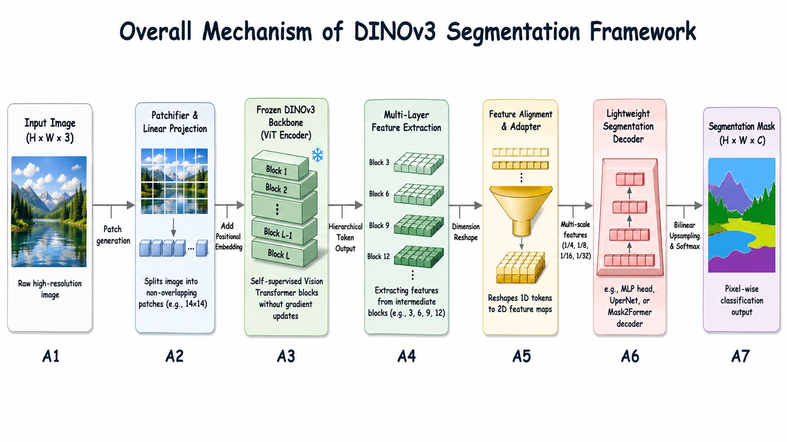
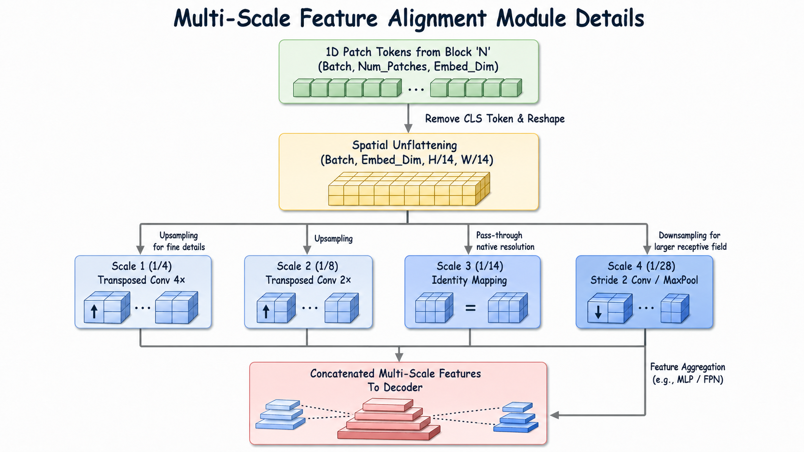

# 🎯 DINOv3 + PSPNet：语义分割的强大组合

> 基于冻结的 DINOv3 ViT-S/16 骨干网络 + PSPNet 金字塔池化模块的高效语义分割方案

## 📊 核心成果

一个冻结的 [DINOv3](https://github.com/facebookresearch/dinov3) ViT-S/16 骨干网络配合 [PSPNet](https://arxiv.org/abs/1612.01105) 金字塔池化模块解码器，用于语义分割任务。仅训练 **2.81 M** 参数，在单张 RTX 5060 Ti 显卡上约 30 分钟内完成训练，在 Pascal VOC 2012 验证集上达到 **86.17 mIoU** ✨，超越原始 PSPNet（ResNet-101 + ImageNet+COCO，85.4），尽管使用了约 10 倍更小且完全冻结的骨干网络。

### 📈 性能对比

| 方法 | 骨干网络 | 骨干参数 | 可训练参数 | VOC val mIoU |
|---|---|---:|---:|---:|
| PSPNet (Zhao et al. 2017) | ResNet-101 (ImageNet) | ~45 M | 全部 | 82.6 |
| PSPNet (Zhao et al. 2017) | ResNet-101 (ImageNet + COCO) | ~45 M | 全部 | 85.4 |
| **本项目 - 单尺度** 🔹 | DINOv3 ViT-S/16 *(冻结)* | 21 M | **2.81 M** | **85.53** |
| **本项目 - 多尺度 + 翻转** 🚀 | DINOv3 ViT-S/16 *(冻结)* | 21 M | **2.81 M** | **86.17** |

### 🎨 定性结果展示



六张验证集图像的并排定性对比

### 🏆 每类 IoU 分布（多尺度 + 翻转）

| 类别 | IoU | 类别 | IoU | 类别 | IoU |
|---|---:|---|---:|---|---:|
| 背景 | 96.50 | 牛 | 93.52 | 人 | 93.16 |
| 飞机 | 94.54 | 餐桌 | 74.21 | 盆栽 | 73.94 |
| 自行车 | 72.08 | 狗 | 94.22 | 羊 | 91.66 |
| 鸟 | 93.61 | 马 | 92.50 | 沙发 | 69.58 |
| 船 | 82.00 | 摩托车 | 92.67 | 火车 | 93.48 |
| 瓶 | 86.29 | 巴士 | 95.84 | 电视 | 82.78 |
| 汽车 | 92.22 | 猫 | 95.48 | 椅子 | 49.31 |

💡 **备注**：传统的 VOC 难分类（椅子、沙发、餐桌、盆栽、自行车）仍是薄弱点，与原始 PSPNet 论文报告的失败模式一致。

---

## 🏗️ 网络架构



**🔒 冻结骨干网络**意味着骨干网络始终处于 `eval()` 模式，从不接收梯度；仅 PPM、分割头和辅助头进行参数更新。

---

## 📁 项目结构

```
configs/
  └─ voc_config.yaml                 # 📋 所有超参数配置

models/
  ├─ backbone.py                     # 🦴 DINOv3 包装器（绕过 torch.hub.load）
  ├─ ppm.py                          # 🔺 金字塔池化模块
  ├─ aux_head.py                     # 📍 辅助分割头
  └─ segmentor.py                    # 🎯 完整的 DINOv3PSPNet

datasets/
  ├─ voc_dataset.py                  # 📊 VOC2012 + 可选 SBD trainaug 分割
  └─ transforms.py                   # 🔄 联合图像+掩码变换

utils/
  ├─ losses.py                       # 💥 交叉熵损失 + 辅助损失
  ├─ metrics.py                      # 📈 流式混淆矩阵 mIoU 计算
  ├─ scheduler.py                    # ⏱️  带预热的多项式学习率
  └─ visualize.py                    # 🎨 VOC 调色板着色与叠加

scripts/
  └─ smoke_test.py                   # ✅ CPU/GPU 前向传播检查

训练和推理
  ├─ train.py                        # 🚂 训练入口
  ├─ eval.py                         # 📊 验证（单尺度/多尺度 + 翻转 TTA）
  └─ infer.py                        # 🎬 目录/单图像推理

存储目录
  ├─ weights/                        # 📦 放置 dinov3_vits16_*.pth 权重文件
  ├─ data/                           # 💾 放置 VOCdevkit/（可选 VOCaug/）
  └─ runs/                           # 📤 输出（日志、检查点、tb、评估 json、推理 png）
```

---

## 🚀 快速开始

### 1️⃣ Python 环境配置

```bash
# 创建并激活 conda 环境
conda create -n dinov3seg python=3.10 -y
conda activate dinov3seg

# 安装依赖
pip install -r requirements.txt
```

✅ **要求**：需要 PyTorch 2.x 及 CUDA 支持以获得合理的训练速度。
其他依赖详见 [requirements.txt](requirements.txt)。

### 2️⃣ 下载 Pascal VOC 2012 数据集

```bash
mkdir -p data && cd data
wget https://thor.robots.ox.ac.uk/pascal/VOC/voc2012/VOCtrainval_11-May-2012.tar
tar -xf VOCtrainval_11-May-2012.tar
# 生成 data/VOCdevkit/VOC2012/{JPEGImages,SegmentationClass,ImageSets/Segmentation,...}
cd ..
```

**📌 完整性检查**：
- `JPEGImages/` 应包含 17,125 张 jpg 图像
- `SegmentationClass/` 应包含 2,913 张 png 掩码（1,464 训练 + 1,449 验证）

**🆕 可选**：使用 SBD 扩增数据集（10,582 张图像的 trainaug 分割）
- 下载 SBD 并将预转换的 `SegmentationClassAug/*.png` 放入 `data/VOCaug/`
- 或保留原始 `dataset/cls/*.mat` 文件——数据集加载器会自动处理
- 在配置中设置 `data.use_sbd: true`

### 3️⃣ 获取 DINOv3 ViT-S/16 预训练权重

DINOv3 权重受保护。在 [DINOv3 仓库](https://github.com/facebookresearch/dinov3) 请求访问权限；Meta 将通过邮件发送带签名的 URL，用于下载 `dinov3_vits16_pretrain_lvd1689m-08c60483.pth`：

```bash
wget -O weights/dinov3_vits16_pretrain_lvd1689m-08c60483.pth \
    "<your signed URL here>"
```

📝 权重路径在 [configs/voc_config.yaml](configs/voc_config.yaml) 中的 `model.backbone.weights_path` 配置。

Python 包（用于实例化 ViT）将在首次运行时通过 `torch.hub` 自动获取，并缓存在 `~/.cache/torch/hub/facebookresearch_dinov3_main/`。

---

## 🎓 训练与推理

### ✅ 烟雾测试（无需真实权重）

快速验证流程是否正确：

```bash
python scripts/smoke_test.py
```

使用随机初始化的假骨干网络端到端运行 PPM + 头 + 损失 + 指标，在几秒内验证形状、梯度流和 mIoU 计算。

### 🏃 训练模型

```bash
python train.py --config configs/voc_config.yaml
```

**⚙️ 训练配置**：
- 骨干网络冻结；约 2.81 M 参数可训练
- AdamW + 自动混合精度（AMP）+ 带线性预热的多项式学习率衰减
- 在 1,464 张图像的训练集上训练 60 个 epoch，单张 RTX 5060 Ti 约需 30 分钟

**📤 输出文件**：
- `runs/dinov3_vits16_pspnet_voc/ckpts/best.pth` — 验证集最佳 mIoU 检查点
- `epoch_NNN.pth` — 每 5 个 epoch 保存一次
- `val_epoch_NNN.json` — 每个 epoch 的完整指标（包含每类 IoU）
- `runs/dinov3_vits16_pspnet_voc/tb/` — TensorBoard 日志
- `runs/dinov3_vits16_pspnet_voc/train.log` — 完整训练日志

**💾 恢复训练**：

```bash
python train.py --config configs/voc_config.yaml \
                --resume runs/dinov3_vits16_pspnet_voc/ckpts/epoch_039.pth
```

### 📊 评估模型

**单尺度评估**：

```bash
python eval.py --config configs/voc_config.yaml \
               --checkpoint runs/dinov3_vits16_pspnet_voc/ckpts/best.pth
```

**多尺度 + 翻转 TTA**（获得 86.17 的标题成绩）：

```bash
python eval.py --config configs/voc_config.yaml \
               --checkpoint runs/dinov3_vits16_pspnet_voc/ckpts/best.pth \
               --multi-scale --flip \
               --output runs/dinov3_vits16_pspnet_voc/eval_msflip.json
```

📌 默认尺度：`[0.5, 0.75, 1.0, 1.25, 1.5]`。每个尺度及其水平翻转产生一个 softmax 图；所有图在双线性插值回原始分辨率后取平均，最后 argmax 得出最终预测。

### 🎬 推理与可视化

```bash
python infer.py --config configs/voc_config.yaml \
                --checkpoint runs/dinov3_vits16_pspnet_voc/ckpts/best.pth \
                --input path/to/image_or_dir \
                --output runs/dinov3_vits16_pspnet_voc/infer_outputs
```

**📸 输出格式**（每张输入图像生成三个输出）：
- `<stem>_pred.png` — 原始类别索引
- `<stem>_mask.png` — VOC 调色板着色
- `<stem>_overlay.png` — 输入图像与着色掩码的混合

---

## 💡 实现注记

理解或扩展代码时的几个关键点：

### 🎯 DINOv3 标记布局
Token 序列为 `[CLS, register_tokens (×4), patch_tokens (×N)]`。仅 patch tokens 进入分割器，重新调整为 `(B, 384, H/16, W/16)`。

### 🔧 绕过 torch.hub.load
DINOv3 的 `hubconf.py` 在模块顶级导入其分割器/检测器/深度估计入口点，这会传递性地引入 `torchmetrics`、`omegaconf` 和我们不需要的自定义 `MultiScaleDeformableAttention` CUDA 扩展。[models/backbone.py](models/backbone.py) 直接从缓存仓库导入 `dinov3.hub.backbones.dinov3_vits16` 并完全跳过 `hubconf.py`。

### 📍 辅助监督
从 transformer 块 `aux_layer_idx`（默认为 6）提取的特征通过 `model.get_intermediate_layers` 传入小型辅助头，加权 `aux_loss_weight=0.4`。辅助头在评估/推理时被丢弃。

### 📏 补丁大小对齐
输入必须是 16 的倍数。训练使用 512×512 随机裁剪；评估对底部/右边缘进行右对齐填充（使用平均颜色），掩码使用 `ignore_index=255` 填充以保持原始长宽比。

### 🚫 ignore_index=255
交叉熵损失和流式混淆矩阵计数器都排除值为 255 的像素，符合 VOC 边界区域注释。

### 🔒 冻结骨干网络纪律
`model.train()` 被重写，以便冻结的 DINOv3 即使在训练循环中也保持 `eval()`——这很重要，因为 ViT 的 LayerNorms 没有运行统计，周围代码也不应尝试将其置于训练模式。

---

## 📦 标准训练运行生成的文件

```
runs/dinov3_vits16_pspnet_voc/
├── config.snapshot.yaml         # 使用的精确配置快照
├── train.log                    # 完整训练日志
├── ckpts/
│   ├── best.pth                 # 最佳 mIoU = 85.53（单尺度）🏆
│   └── epoch_004.pth ... epoch_059.pth
├── tb/                          # TensorBoard 事件文件
├── val_epoch_000.json ... val_epoch_059.json
├── eval_msflip.json             # 多尺度 + 翻转指标 → mIoU 86.17 ⭐
└── infer_outputs/
    ├── 2010_003597_pred.png  + _mask.png  + _overlay.png   (×6 验证图像)
    └── _compare_grid.png        # 4 面板并排对比 📊
```

---

## 📚 参考资源

| 资源 | 链接 |
|---|---|
| 📖 DINOv3 论文 & 代码 | [arxiv.org/abs/2508.10104](https://arxiv.org/abs/2508.10104) · [github.com/facebookresearch/dinov3](https://github.com/facebookresearch/dinov3) |
| 🔺 PSPNet 论文 | [arxiv.org/abs/1612.01105](https://arxiv.org/abs/1612.01105) |
| 🗂️ Pascal VOC 2012 数据集 | [host.robots.ox.ac.uk/pascal/VOC/voc2012/](http://host.robots.ox.ac.uk/pascal/VOC/voc2012/) |
| 🎓 DINOv3 分割教程 | [debuggercafe.com/semantic-segmentation-with-dinov3/](https://debuggercafe.com/semantic-segmentation-with-dinov3/) |

---

## ⚖️ 许可证

DINOv3 权重受 [DINOv3 许可协议](https://github.com/facebookresearch/dinov3/blob/main/LICENSE.md) 约束。
Pascal VOC 2012 受其自身条款约束。
